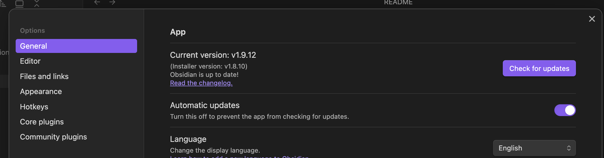
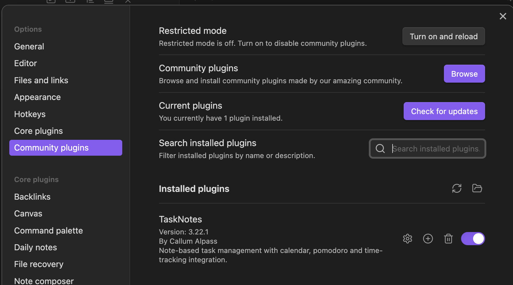
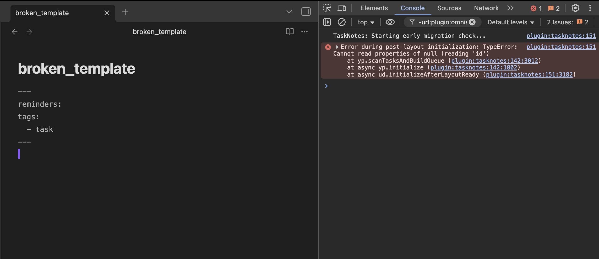

# About

TaskNotes issue for this bug is [here](https://github.com/callumalpass/tasknotes/issues/583).

This GitHub repo contains an obsidian vault with a minimal setup that demonstrates a bug that happens when [TaskNotes](https://github.com/callumalpass/tasknotes) 3.22.1 uses a template that contains an empty `reminders` property in yaml frontmatter.

Error is `TypeError: Cannot read properties of null (reading 'id')`.

---
# Environment

- **OS:** macOS Sequoia 15.5
- **Obsidian:** v1.9.12
- **Installer version:** v1.8.10
- **TaskNotes:** v3.22.1
- **Community plugins enabled:** TaskNotes

##### OS version


##### Obsidian Version



##### TaskNotes version


---
# Vault setup

These steps are already done and reflect the current state of the vault in GitHub. Please see `# Reproduction steps` for how to make the bug happen.

1. Create new vault
2. Turn on community plugins
3. Install and enable TaskNotes version 3.22.1
4. Create file `broken_template` with contents:
  
```
---
reminders:
tags:
  - task
---
```

5. In TaskNotes tab `Task defaults`,  leave `Task tag` as `task`
6. In TaskNotes tab `Task defaults`,  turn on option `Use body template`
7. In TaskNotes tab `Task defaults`,  set option `Body template file` to `broken_template`




---

# Reproduction steps

1. In Obsidian menu bar select `View --> Toggle Developer Tools`. Make sure Console window is open in Developer Tools.
2. In Obsidian settings, in `Community plugins`, toggle TaskNotes off and back on
3. Observe error in Developer Tools Console:

```
plugin:tasknotes:151 Error during post-layout initialization: TypeError: Cannot read properties of null (reading 'id')
```


---

# Location in code

- The error is being thrown from a try block starting on [line #329 of src/main.ts in commit hash 4b252c9](https://github.com/callumalpass/tasknotes/blob/4b252c9033b903d5352028ba45a5829f837174ea/src/main.ts#L329)

